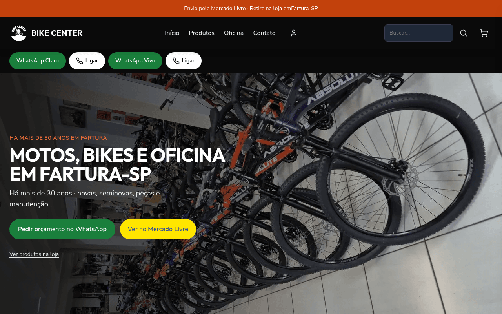
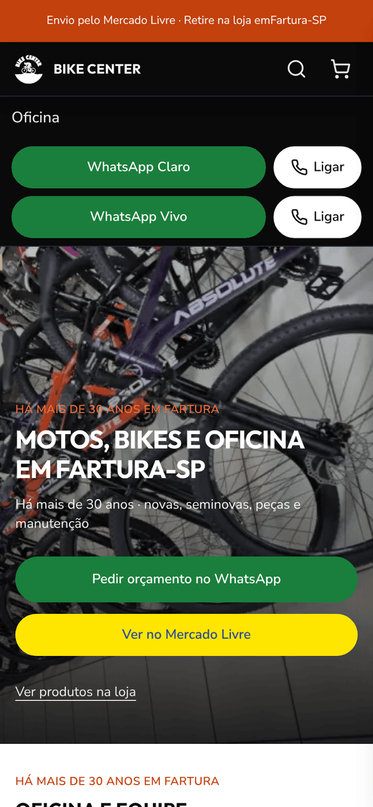
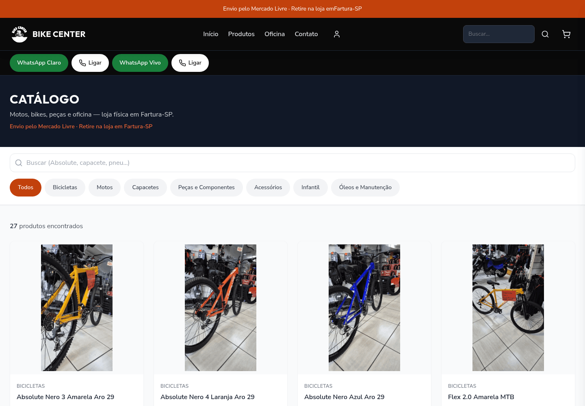
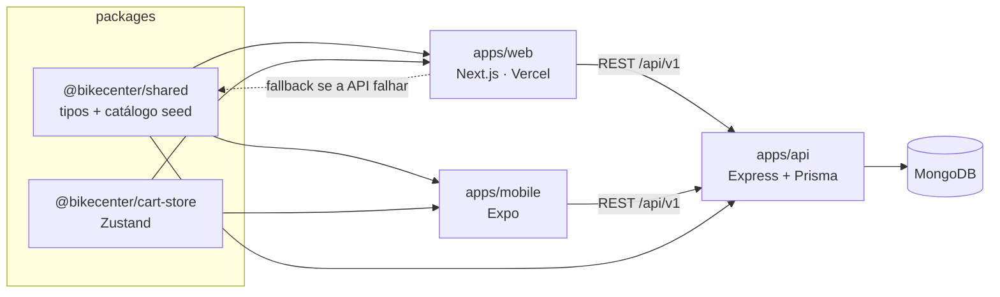

# Bike Center Fartura: e-commerce e vitrine

[](https://github.com/AlanDiogoR/bike-center/actions/workflows/ci.yml)


Este monorepo reúne o site da **Bike Center Fartura**, uma loja física de **motos, bikes, peças e oficina** em Fartura-SP (Rua Mário Stella, 355). O código tem três partes:

- uma vitrine web em Next.js com catálogo, páginas de produto, carrinho e contato por WhatsApp;
- uma API REST em Express + Prisma (MongoDB);
- um app mobile em Expo.

Os dados oficiais da loja (endereço, horários, telefones, redes) ficam centralizados em [`apps/web/src/lib/site.ts`](apps/web/src/lib/site.ts). Copy, SEO e JSON-LD usam essa mesma fonte.

**Produção (web):** https://bike-center-web.vercel.app

| Home (desktop) | Home (mobile) |
|---|---|
|  |  |



> Capturas feitas da produção (`bike-center-web.vercel.app`) com Chrome headless.

---

## Stack

As versões vêm do `package.json` de cada app e foram conferidas no `pnpm-lock.yaml`.

| Camada | Tecnologias |
|---|---|
| **Web** (`apps/web`) | Next.js 14.2 (App Router), React 18.3, Tailwind CSS 3.4, Zustand 5, TanStack Query 5, React Hook Form + Zod, Radix Accordion, Framer Motion |
| **API** (`apps/api`) | Node.js 20, Express 4.22, Prisma 6.19 (MongoDB), Zod 3, JWT + bcryptjs, Helmet, express-rate-limit, Pino |
| **Mobile** (`apps/mobile`) | Expo 54, Expo Router 6, React Native 0.81, NativeWind 4 |
| **Pacotes** (`packages/`) | `@bikecenter/shared` (tipos, validadores, catálogo seed), `@bikecenter/cart-store` (store de carrinho Zustand com `persist`, usada pela web e pelo mobile) |
| **Linguagem** | TypeScript 5.9 |
| **Testes** | Vitest 2.1 (web: jsdom + Testing Library; API: Supertest) |
| **Monorepo** | pnpm workspace (`apps/*`, `packages/*`), `packageManager: pnpm@10.0.0` |
| **Infra** | Dockerfile multi-stage da API (`node:20-alpine`, com healthcheck), `docker-compose.yml`, GitHub Actions, Vercel (web), Railway (alvo configurado da API) |

## Funcionalidades (verificadas no código)

**Vitrine e conversão**
- **Catálogo `/produtos`** com busca, filtro por categoria e paginação ([`ProductListPage.tsx`](apps/web/src/app/produtos/ProductListPage.tsx) e `produtos/components/`).
- **Página de produto `/produtos/[slug]`** com galeria e `generateMetadata` por produto.
- **Fallback do catálogo:** quando a API não responde, a vitrine usa o catálogo seed de `packages/shared` ([`lib/api.ts`](apps/web/src/lib/api.ts)). A API reaproveita esse mesmo catálogo no `db:seed`.
- **Carrinho** com drawer no header e página `/carrinho`, persistido via `@bikecenter/cart-store`. Também há um checkout com validação Zod (inclui CPF).
- **`/oficina`**: página da oficina com foto real e botões de WhatsApp e Ligar.
- **`/contato`**: endereço, horário, as duas linhas de WhatsApp (Claro e Vivo) e e-mail.
- **CTAs de WhatsApp (`wa.me`) e `tel:+E.164`** gerados a partir de uma fonte única (`whatsappUrl`, `telHref` em `lib/site.ts`).

**SEO técnico**
- `sitemap.xml` dinâmico (rotas públicas + slugs de produto) e `robots.txt` que bloqueia login, cadastro, carrinho e checkout ([`app/sitemap.ts`](apps/web/src/app/sitemap.ts), [`app/robots.ts`](apps/web/src/app/robots.ts)).
- Metadata por rota com canonical, Open Graph e Twitter ([`lib/metadata.ts`](apps/web/src/lib/metadata.ts)), aplicada em `/produtos`, `/oficina` e `/contato`.
- JSON-LD ([`lib/jsonld.ts`](apps/web/src/lib/jsonld.ts), [`lib/faq.ts`](apps/web/src/lib/faq.ts)):
  - `LocalBusiness`/`Store` com endereço, geo e horários;
  - `WebSite` com `SearchAction`;
  - `Product` + `BreadcrumbList` nas páginas de produto;
  - `FAQPage` igual ao FAQ que aparece na home.
- Verificação do Google Search Console via `metadata.verification` no layout.

**Acessibilidade (público 45+)**
- Contraste WCAG ≥ 4,5:1 nos botões e no texto laranja. Há testes automatizados que usam uma função de contraste própria ([`lib/contrast.ts`](apps/web/src/lib/contrast.ts), `tests/orange-contrast.test.ts`, `tests/a11y-p0.test.tsx`).
- Alvos de toque com `min-h-11`/`min-h-12`, link "Pular para o conteúdo" e `lang="pt-BR"`.

**Performance**
- Imagens WebP em `public/images` e hero da home com `next/image` e um único `priority` para o LCP. Um teste garante que nenhuma outra imagem usa `priority` (`tests/site.test.ts`).

**API**
- Rotas `/api/v1`: auth, users, products, categories, orders, cart e checkout, além de `/api/v1/health` com ping no banco.
- Segurança: Helmet, CORS configurável e rate limit, com limite próprio para auth. O checkout valida o preço no servidor (testado), e o CPF é guardado como hash SHA-256.

## Arquitetura

```
bike-center/
├── apps/
│   ├── web/        # Next.js (App Router): vitrine, SEO, testes em src/tests
│   ├── api/        # Express + Prisma (MongoDB), Dockerfile, testes em src/tests
│   └── mobile/     # Expo + Expo Router
├── packages/
│   ├── shared/     # tipos, validadores (CPF) e catálogo seed
│   └── cart-store/ # store de carrinho Zustand (web + mobile)
├── .github/workflows/  # ci.yml, deploy.yml
├── docker-compose.yml  # sobe a API em container
└── pnpm-workspace.yaml
```



## Como rodar

**Pré-requisitos:** Node.js ≥ 20 e pnpm (o repo fixa `pnpm@10.0.0` em `packageManager`; com Corepack basta rodar `corepack enable`). Para usar a API de verdade é preciso um MongoDB (Atlas ou local). Docker é opcional.

```bash
git clone https://github.com/AlanDiogoR/bike-center.git
cd bike-center
pnpm install

cp apps/web/.env.example apps/web/.env.local
cp apps/api/.env.example apps/api/.env       # preencha com seus valores

pnpm dev:web            # só a vitrine (funciona sem API, via catálogo seed)
pnpm dev                # todos os apps em paralelo
```

| Tarefa | Comando |
|---|---|
| Build de tudo | `pnpm build` |
| Testes web / API | `pnpm --filter web run test` · `pnpm --filter api run test` |
| Typecheck | `pnpm --filter web typecheck` · `pnpm --filter api typecheck` |
| Lint (web, `next lint`) | `pnpm lint` |
| Banco (MongoDB) | `pnpm --filter api db:push` · `pnpm --filter api db:seed` |
| API em Docker | `docker compose up -d` (lê `apps/api/.env`, porta 3333) |

### Variáveis de ambiente

Os nomes abaixo vêm dos arquivos `.env.example`. Os valores de exemplo ficam nesses arquivos; nunca versione segredos.

| App | Variáveis |
|---|---|
| `apps/web` | `NEXT_PUBLIC_API_URL`, `NEXT_PUBLIC_API_HOSTNAME`, `NEXT_PUBLIC_SITE_URL` |
| `apps/api` | `DATABASE_URL`, `PORT`, `NODE_ENV`, `JWT_SECRET`, `CORS_ORIGIN` (ou `CORS_ORIGINS`), `SEED_ADMIN_EMAIL`, `SEED_ADMIN_PASSWORD`, `API_URL` |
| `apps/mobile` | `EXPO_PUBLIC_API_URL` |

## Deploy e CI

- **Web (Vercel):** https://bike-center-web.vercel.app (`apps/web/vercel.json`).
- **API (Railway):** configurada em `.github/workflows/deploy.yml` (Railway CLI) e no `apps/api/Dockerfile`. No momento não há URL pública ativa da API, e a vitrine usa o fallback do catálogo seed.
- **CI** (`.github/workflows/ci.yml`), em todo PR para `main`:
  1. instala com `--frozen-lockfile`;
  2. faz build dos pacotes compartilhados;
  3. roda o typecheck da web e da API;
  4. roda os testes Vitest da web e da API.

  Em push na `main`, um job extra faz o build da imagem Docker da API e publica no GHCR.

## Qualidade e processo

O projeto evolui em **PRs pequenos e temáticos**. Todo PR para `main` passa pelo CI (typecheck + testes) antes do merge, e os PRs de interface também passam por QA visual com capturas. As mudanças de feature e de correção vêm com testes Vitest que travam o comportamento (por exemplo, `route-metadata.test.ts`, `orange-contrast.test.ts` e `gsc-verification.test.ts`). Até agora foram 16 PRs mergeados. Alguns marcos:

| PR | Marco |
|---|---|
| #1 | Copy da loja de Fartura, sitemap, fotos 4:5 e layout mobile (~390px) |
| #3 | Catálogo com páginas de produto (PDP) reais |
| #6 | Hero em WebP otimizado para o LCP da home |
| #7 / #9 | Correções de CI: tag do GHCR em minúsculas, PATH do Railway CLI e Corepack/pnpm 10 no build Docker |
| #10 / #11 / #12 | Acessibilidade para o público 45+: `tel:`, contraste do WhatsApp e do laranja ≥ 4,5:1 |
| #13 | Página `/oficina` com WhatsApp e Ligar |
| #14 / #16 / #17 / #18 | SEO: verificação no GSC, metadata por rota, `FAQPage`, limpeza de headings/alt e telefone fixo no `LocalBusiness` |

Histórico completo: [PRs mergeados](https://github.com/AlanDiogoR/bike-center/pulls?q=is%3Apr+is%3Amerged).

## Autor

**Alan Diogo**, estudante de Engenharia de Software na UTFPR (Cornélio Procópio)
GitHub: [@AlanDiogoR](https://github.com/AlanDiogoR)
